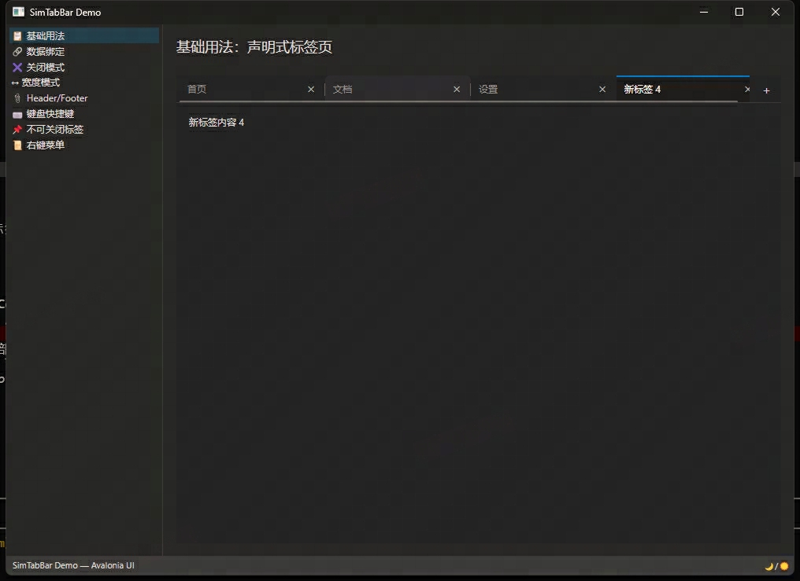

# SimTabBar

类似 VS Code 的标签页 Avalonia 控件库。

## 功能特性

- **宽度模式** — Equal / SizeToContent / Compact 三种标签页宽度策略
- **关闭按钮模式** — Auto / OnPointerOver / Always 三种显示方式
- **右键菜单** — 关闭 / 关闭其他 / 关闭全部
- **扩展区域** — TabStrip Header / Footer 可插入自定义内容
- **键盘导航** — Ctrl+Tab / Ctrl+Shift+Tab、Ctrl+F4（关闭）
- **固定标签页** — 支持不可关闭的固定标签
- **主题支持** — 适配深色 / 浅色主题