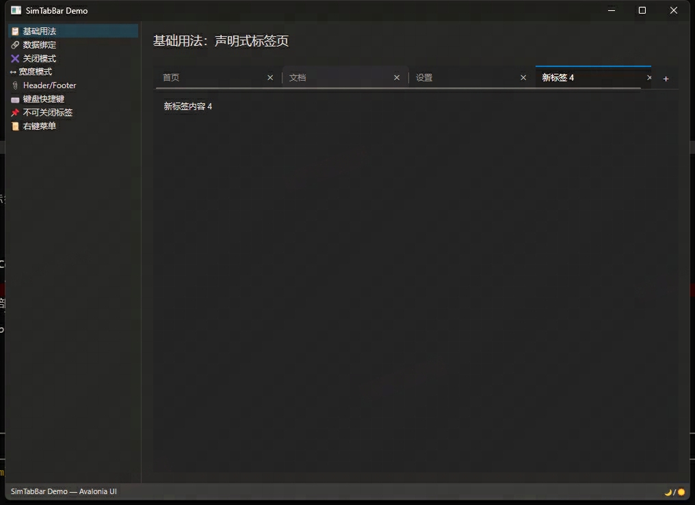

# SimTabBar

类似 VS Code 的标签页 Avalonia 控件库。



## 功能特性

- **宽度模式** — Equal / SizeToContent / Compact / Fixed 四种标签页宽度策略
- **标签头模板** — `HeaderTemplate` 让标签头渲染任意多元素（如状态圆点 + 标题），模板上下文为数据项，可对局部元素单独着色；`TabBar.HeaderTemplate` 在 ItemsSource 模式下生效
- **关闭按钮模式** — Auto / OnPointerOver / Always 三种显示方式
- **右键菜单** — 关闭 / 关闭其他 / 关闭全部
- **扩展区域** — TabStrip Header / Footer 可插入自定义内容
- **键盘导航** — Ctrl+Tab / Ctrl+Shift+Tab、Ctrl+F4（关闭）
- **固定标签页** — 支持不可关闭的固定标签
- **拖动排序** — `CanReorderTabs` 开启后按住标签拖动换位（实时让位空隙）；`TabDragStarting` 可取消，`TabReorderCompleted` 报告结果
- **主题支持** — 适配深色 / 浅色主题
- **可自定义颜色** — 选中标签的底色 / 文字 / 顶部指示条都是主题资源键，可在 Window / App 级覆盖（含运行期换色），见下文

## 自定义颜色

选中标签的三个颜色都是主题资源键（`{DynamicResource}`，运行期可换）。在任意更外层放同名的键即可覆盖：控件 / `Window` / `Application` 三级都行，深色浅色可以用 `ThemeDictionaries` 分档各给一套。

| 资源键 | 深色 | 浅色 | 作用 |
| --- | --- | --- | --- |
| `SimTabBarItemBackgroundSelected` | `#1E1E1E` | `#FFFFFF` | 选中标签底色 |
| `SimTabBarItemForegroundSelected` | `#FFFFFF` | `#1E1E1E` | 选中标签文字 |
| `SimTabBarItemActiveIndicatorBrush` | `#007ACC` | `#007ACC` | 标签顶部指示条 |

静态覆盖（深色浅色共用一个值）：

```xml
<Window.Resources>
    <SolidColorBrush x:Key="SimTabBarItemBackgroundSelected" Color="#7A1F1F" />
</Window.Resources>
```

运行期换色（用户选色 / 明暗各一套）：

```csharp
var resources = Application.Current!.Resources;
resources.ThemeDictionaries[ThemeVariant.Dark] = new ResourceDictionary
{
    ["SimTabBarItemBackgroundSelected"] = new SolidColorBrush(Color.Parse("#7A1F1F")),
    ["SimTabBarItemForegroundSelected"] = new SolidColorBrush(Color.Parse("#FFE9E9")),
    ["SimTabBarItemActiveIndicatorBrush"] = new SolidColorBrush(Color.Parse("#E06C6C")),
};
```

尺寸类（`SimTabBarItemMinWidth` / `SimTabBarItemMaxWidth` / `SimTabBarItemCompactWidth` / `SimTabBarItemFixedWidth` / `SimTabBarItemPadding` / `SimTabBarItemCloseButtonSize` / `SimTabBarActiveIndicatorHeight`）同样可以按名覆盖，全部键位见 `SimTabBar/Themes/SimTabBarTheme.axaml`。

运行 `SimTabBarDemo` 的「🎨 自定义颜色」场景页可以现场验证。